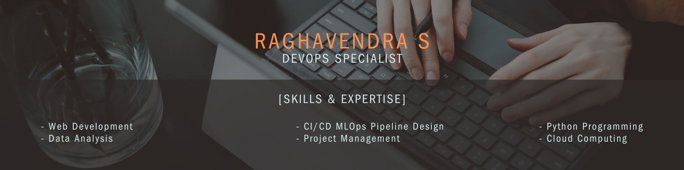

<p align="center">
  
</p>


# Bike Rental Prediction MLOps Pipeline 🚲

## Overview


This project implements a **full Cloud MLOps pipeline** for predicting bike rental demand using AWS S3, EC2, and Python. It covers:

- Data Preprocessing
- Hyperparameter Tuning
- Model Training
- Model Inference
- Saving and Fetching Models and Predictions from AWS S3

Designed to be cloud-native, modular, and production-ready!

---

## 📁 Project Structure

```
bike-rental-cloud-pipeline/
├── configs/
│   └── config.yaml           # AWS S3 paths + model configs
├── data/                     # (Optional) Local downloaded data from S3
│   ├── bike_rental.csv        # Original dataset
│   └── bike_rental_new.csv    # New unseen data for drift detection (optional)
├── processed/                 # Preprocessed train-test splits and scaler
│   ├── train_test_split.joblib
│   └── feature_scaler.joblib
├── models/                    # Locally saved trained model
│   └── best_model.joblib
├── predictions/               # Model predictions stored locally
│   └── predictions.csv
├── scripts/
│   ├── preprocessing.py       # Download data from S3 and preprocess
│   ├── train_model.py          # Train model and upload to S3
│   └── model_inference.py      # Download model, predict and upload predictions
├── Banner.jpg                 # Project cover image
├── README.md                  # Project documentation
├── requirements.txt           # Python dependencies

```

---

## 🧪 Environment Setup

```bash
# Install required packages
pip install -r requirements.txt
```

---

## 🔥 How to Run

### Step 1: Preprocess Data

```bash
python scripts/preprocessing.py
```

- Reads `bike_rental.csv`
- Cleans, scales, splits into train/test
- Saves processed files into `processed/`

### Step 2: Train and Tune Model

```bash
python scripts/train_model.py
```

- Loads train/test splits
- Runs RandomizedSearchCV for hyperparameter tuning
- Saves the best model to `models/`

### Step 3: Model Inference

```bash
python scripts/model_inference.py
```

- Loads the trained model and test set
- Generates predictions
- Saves results to `predictions/`

---

## 📚 Key Features

- Clean train-test split
- Feature scaling (without scaling the target)
- Randomized Search for hyperparameter tuning
- Joblib-based model persistence
- Modular and extensible structure
- Supports data drift detection using historical and new unseen datasets.

---

## 💡 Future Enhancements
- Add FastAPI server for real-time inference
- Integrate MLflow for tracking experiments
- Setup Airflow for end-to-end automation
- Expand to multiple models (XGBoost, LightGBM)

---

Happy Coding! 🎯
